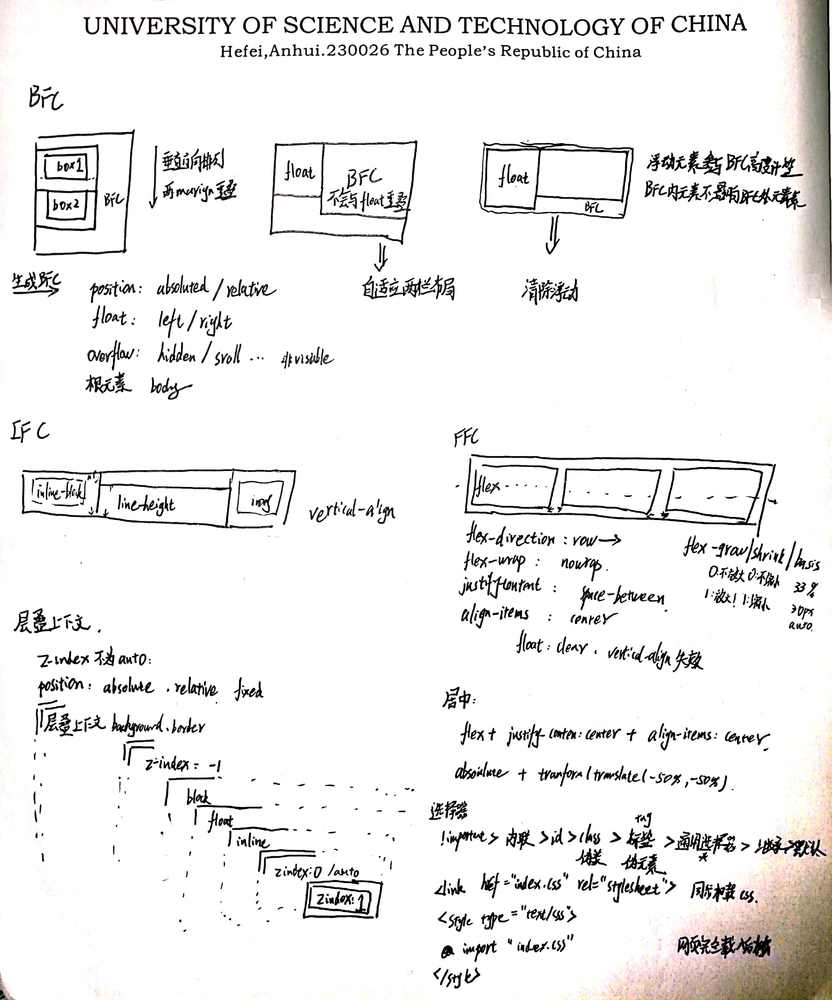
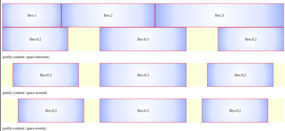

### 盒模型
通过box-sizing设置
* content-box 标准模型
    * 宽高不包括边框
* border-box  IE模型
    * 宽高包括边框border和padding

### JS获取宽高
* dom.offsetHeight 最佳
* dom.style.height 只能获取内联样式
* dom.getBoundingClientRect().width/height 根据元素在视窗中的绝对位置来获取宽高的
* window.getComputedStyle(dom).width/height
* dom.currentStyle.width/height  页面渲染完成后的结果，就是说不管是哪种方式设置的样式，都能获取到。但这种方式只有IE浏览器支持

### BFC 
块级格式化上下文，是一个独立的渲染区域，让处于 BFC 内部的元素与外部的元素相互隔离，使内外元素的定位不会相互影响。
[](https://www.cnblogs.com/lhb25/p/inside-block-formatting-ontext.html)
[](https://zhuanlan.zhihu.com/p/25321647)

### 层叠上下文
[](https://juejin.im/post/5b876f86518825431079ddd6)
[](https://juejin.im/post/5b876f86518825431079ddd6#heading-8)

例子：
```
<div >
    <div>

    </div>
</div>
```

层叠上下文的background/border < z-index小于0 < block < float < inline < z-index=0,auto < z-index大于0

如果产生了层叠上下文 那么比较其背景与子元素
没有的话就是普通元素 block

### 居中布局

[flex](https://www.zhangxinxu.com/wordpress/2018/10/display-flex-css3-css/)


.parent {
    display: flex;
    justify-content: center;
}

.parent {
    display: flex;
    align-items: center;
}


* 水平居中

    * 行内元素: text-align: center
    * 块级元素: margin: 0 auto
    * absolute + transform
    * flex + justify-content: center


* 垂直居中

    * line-height: height
    * absolute + transform
    * flex + align-items: center
    * table <table> <tr> <td>12 </td> </tr> </table>


* 水平垂直居中

    * absolute + transform
    * flex + justify-content + align-items
    * fixed margin:auto left:0 right:0 right:0 bottom：0


### 选择器优先级

!important > 内联样式 > id > class(属性选择器[]、伪类 :) > 标签(伪元素) > 通用选择器 > 继承 > 默认

后定义的优先级较高


[css选择器参考](./选择器.md)

### display：none visibility=0的区别
* display:none 是真的在页面上消失，不占用空间
* visibility=0 是不见了，但还是占了空间

### position
* static 
* absolute  元素相对于最近的非 static 定位祖先元素的偏移，来确定元素位置。如果没有就是相对于body
* relative 相对自己原来的位置
* fixed 相对窗口的绝对定位定位
    * top bottom left right 是相对于最外边距的距离。（content + padding + border + margin）
### 浮动清除 （去除浮动影响，防止父级高度塌陷）
```
<div class="outer">
  <div class="inner">1</div>
  <div class="inner">2</div>
  <div class="inner">3</div>
</div>
```

* 通过增加尾元素清除浮动 :after / <br> : clear: both
    * clear:both 左右两侧均不能出现浮动元素

(::after 是css3提出的 和 :after相同 ，都是伪元素，作为已选中元素的最后一个子元素。为了兼容性 建议使用:after)
```
#clear{
  clear: both;
}

<div class="outer">
  <div class="inner">1</div>
  <div class="inner">2</div>
  <div class="inner">3</div>
  <div id="clear"></div>
</div>

```

```

```

* 创建父级 BFC 

```
.outer{
    overflow:hidden;
}
```
* 父级设置高度


### <link> 与 @import 的区别
* link功能较多，可以定义 RSS，定义 Rel 等作用，而@import只能用于加载 css
<link rel="stylesheet" href="****.css" type="text/css">
<style type="text/css">
@import "***.css"
</style>
* 当解析到link时，页面会同步加载所引的 css，而@import所引用的 css 会等到页面加载完才被加载
* @import需要 IE5 以上才能使用
* link可以使用 js 动态引入，@import不行

### CSS预处理器(Sass/Less/Postcss)
* Less
* Sass/Scss
* postCSS
* [scss](https://www.jianshu.com/p/a99764ff3c41)

### 总结


### FFC
flex: flex-grow, (flex-shark,flex-basis)的简写  
  *  默认: =>0 1 auto （等比缩小）
  * auto:=> 1 1 auto（等比放大缩小）
  * none:=> 0 0 auto （原来大小）
  * flex:1 => 1 1 auto（等比放大缩小）  

flex：0.125 flex：0.5 flex 0.25
  即flex-grow总和小于1时，占用剩余空间的12.5% 50% 25% ，剩余空间占比1：4：2 剩下12.5%不被占用


### BFC:块级格式化上下文
规定了内部的Block-level Box如何布局，并且与这个区域外部毫不相干。从上至下排列、上下margin合并、除float元素外的box的margin-box与BFC的左边相接、BFC不会被float元素覆盖、BFC内元素布局不会影响外部布局

### IFC：
 content box/area的高由font-size/line-height决定的；
content box/area的宽等于其子行级盒子的外宽度(margin+border+padding+content width)之和。
当inline-level box宽度大于父容器宽度时会被拆分成多个inline-level box
IFC则是表示盒子从左到右的水平排列方式
[IFC](https://juejin.im/entry/587c41f91b69e6006bf1b8ec)

### BEM
.block {}
.block__element {}
.block__element--modifier {}

### block inline
block 块元素    inline 内联元素

常见的块元素有：div, p, h1~h6, table, form, ol, ul等

常见的内联元素有：span, a, strong, em, label, input, select, textarea, img, br等

block:
1. 独占一行
2. 设置width,height、margin和padding属性。

inline:
1. 共占一行至换行
2. width,height无效、水平方向margin和padding产生边距效果，竖直方向无效

inline-block：
多个元素可以同排一行，且元素具有block的属性，可设置宽高，是block和inline元素的综合体。

### 可替换元素

可替换元素（replaced element）的展现效果不是由 CSS 来控制的，CSS 可以影响可替换元素的位置，但不会影响到可替换元素自身的内容。
典型的可替换元素有：
```html
<iframe>
<video>
<embed>

```

object-fit：指定可替换元素的内容对象在元素盒区域中的填充方式。  
object-position
指定可替换元素的内容对象在元素盒区域中的位置。

### 文本截断
单行文本截断： text-overflow:ellipsis 
多行文本截断：
display: -webkit-box;
  overflow: hidden;
  -webkit-line-clamp: 2;
  -webkit-box-orient: vertical;

CSS方法：
::after {
    content:"...";
    font-weight:bold;
    position:absolute;
    bottom:0;
    right:0;
    padding:0 20px 1px 45px;
    background: linear-gradient(to right, rgba(255, 255, 255, 0), white 50%, white);
}

### tips
scale(-1,-1) 等价于旋转180度

