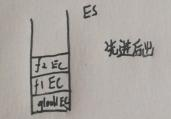
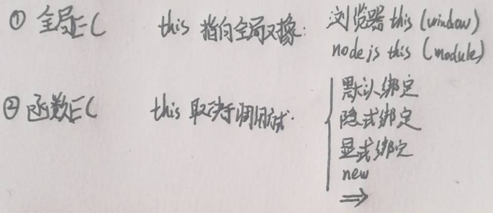
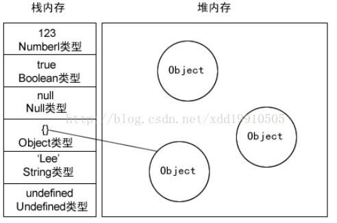

# 复制变量、作用域和垃圾收集
## 赋值变量
1. 复制变量和传参：基本变量完全独立，引用类型的指针指向存储在堆中的同一个对象。
2. typeof 操作符用于检测基本类型值。instanceof 操作符检测一个引用类型值和 Object 构造函数时，instanceof 操作符始终会返回 true。当然，如果使用 instanceof 操作符检测基本类型的值，则该操作符始终会返回 false，因为基本类型不是对象。[test1](javascript/test1.js)

## 作用域
1. EC（执行环境）<————>VO(变量对象)
2. 代码执行时，创建   
Scope Chain： 当前VO ——>外部EC ——> …… ——> 全局EC  
标识符解析： ——————————————————————>
3. var没有块级作用域, let有块级作用域。[test2](javascript/test2.js)
4. 函数内部初始化变量时没有使用 var 声明，该变量会自动被添加到全局环境。在严格模式下，初始化未经声明的变量会导致错误。

## 垃圾回收
1. 标记清除 （从根部（在JS中就是全局对象）出发定时扫描内存中的对象，凡是能从根部到达的对象，保留。那些从根部出发无法触及到的对象被标记为不再使用，稍后进行回收。）
2. 引用计数（js对象循环引用，IE8的DOM/BOM对象循环引用）-手动null

# 数组类型的常用操作方法
1. 数组的每一项可以保存任何类型的数据
2. 数组大小动态调整
3. 创建方式：
    * new Array() [test3](javascript/test3.js)
    * 使用字面量[]
4. 数组的length可以设置，非只读的，可以通过length添加或者移除数组元素
5. 检测数组
    * value instanceof Array
    * Array.isArray(value)
6. 转换方法
    * toString() [test4](javascript/test4.js)
    * valueOf()
    * join    
7. 变异方法 
    * push() pop()栈方法
    * shift() unshifit() 队列方法
    * reverse() 反转 sort（）字典序排序
    * 带compare函数的sort() 数值排序 [test5](javascript/test5.js)
    * splice() ---- 拼接（起始位置、要删除的项数（0）和要插入的项）
8. 非变异方法
    * concat() 方法 ---- 创建数组副本(有参数的拼在数组末尾)
    * slice() 方法 ---- 截取部分数组    
9. 位置方法indexOf() lastIndexOf()
10. 迭代方法（非变异） 
    * every()：数组中每一项都满足函数条件，则返回 true。
    * filter()：筛选数组中满足函数条件的项组成的数组。
    * forEach()：对数组中的每一项运行给定函数。这个方法没有返回值。
    * map()：对数组中的每一项运行给定函数，返回运行结果组成的新数组。
    * some()：数组中只要有一项满足函数条件，则返回 true。
    ```js
    var someResult = numbers.some(function(item, index, array){ 
      return (item > 2); 
    }); 
    ```
 11. 归并方法（非变异）
    * reduce()方法从数组的第一项开始，逐个遍历到最后。
    * reduceRight()则从数组的最后一项开始，向前遍历到第一项。   
    ```js
    var sum = values.reduceRight(function(prev, cur, index, array){ 
    return prev + cur; 
    }); 
    ```
# 常用引用类型（Object、Array、Function、Date、RegExp）

## Function类型
1. 函数声明： 声明提升
```js
function sum (num1, num2) { 
	return num1 + num2; 
} 
```
2. 函数表达式： 不提升
```js
var sum = function(num1, num2){ 
	return num1 + num2; 
};
```
3. 函数重复声明会覆盖：没有重载
4. 函数可以作为函数参数、可以作为结果返回
5. 函数的属性和方法(函数也是Object，包含属性和方法)   
   1. 特殊对象：arguments和this
    * arguments 对象是类数组（它并不是 Array 的实例）
    * arguments.callee 指向拥有这个 arguments 对象的函数本身
    * (function || arguments.callee).caller 调用当前函数的函数的引用(全局函数的引用)
    * arguments.length 实现-重载
   2. 属性：length和prototype     
    * prototype 是保存函数所有实例方法的真正所在
    * prototype 不可枚举  

6. 扩充作用域apply和call  
   1. 方法（非继承):apply() 和 call()  
   * 在特定的作用域中调用函数,实际上等于设置函数体内 this 对象的值
   * apply() arg[0]:运行函数的作用域 arg[1]:参数数组
   * call()  arg[0]:运行函数的作用域 arg[1~n]:参数1~n

### 数据类型
* 简单类型：undefined null boolean number string 
* 复杂类型：object
### typeof
* undefined
* boolean 
* number 
* string 
* object -> 对象或null
### Number
* Infinity
* NaN 
  * NaN不等于任何数 包括自身
  * parseInt(" ",10);
  * parseFloat(" ") ;
### String 
* num.toString(10);
* String(num);
### Object
* constructor  返回构造函数 创建当前对象的函数
* hasOwnProperty() 自己是否有某个属性
* isPrototypeOf() 是否是该对象的原型
* propertyIsEnumerable() 该属性能否用for-in枚举 一定是自身属性且可枚举
### function 参数
* 实际传递参数和声明的参数数量不需要一样
* arguments 可以获得传递的参数数组
  * length 参数数量
  * arguments[0] 调用参数
  * 修改arguments 会同时修改传递的参数
### 区分String对象 string基本数据类型
### for if 语句中声明的变量会添加到当前的执行环境中 注意区分函数
### Array
* isArray() toString() valueOf() join()
* push() pop() shift() unshift()
* reserve() sort()
* concat() slice() splice() 
* indexOf() lasetIndexOf()
* every() some() forEach() filter() map() 
* reduce() reduceRight()
### Date
### Function
* 函数内部属性
  * arguments.callee 指向拥有该arguments的函数
  * this 引用的是函数执行的环境对象
  * caller 当前函数的函数的引用
* 函数属性和方法
  * length 参数个数
  * prototype  ----------------见后续
  * apply(),call()
  * bind() 会创建函数实例

# 词法作用域（静态作用域）
函数的作用域在 **函数定义** 的时候就决定了。
```js
var value = 1;

function foo() {
    console.log(value);
}

function bar() {
    var value = 2;
    foo();    // foo中value的作用域为全局EC而不是bar的函数EC
}

bar(); // 结果是1 不是2
```

# 执行上下文和执行栈
全局代码初始化时首先ECS压入一个全局EC
遇到函数执行时，创建一个函数EC。

## 执行上下文
 1. 全局EC： window（浏览器）、moudle（node）
 2. 函数EC： 函数每次被调用时创建
 3. ~~evalEC： 不常见~~

## 执行栈
  存储代码执行期间创建的所有EC
  

## EC的创建阶段与执行阶段
 
#### 伪代码
```js
ExecutionContext = {
  ThisBinding = <this value>  //1. 确认this
  VO = {...}                  //2. 与EC相关的数据作用域，存储了EC中定义的变量和函数声明。
  ScopeChain = {...}          //3. 作用域链
}
```
全局上下文中的变量对象就是全局对象window（浏览器）、moudle（node）
（全局对象是由 Object 构造函数实例化的一个对象）

### 创建

####  1. this Binding (确认this)

* 默认绑定：独立函数调用，this指向全局对象。
* 隐式绑定：当函数引用有上下文对象时，隐式绑定规则会把函数中的this绑定到这个上下文对象。
* 显示绑定：通过call(..) 或者 apply(..)方法。第一个参数是一个对象，在调用函数时将这个对象绑定到this。因为直接指定this的绑定对象，称之为显示绑定。call或者apply绑定null或者undefined时this为默认绑定
    * 硬绑定 bind,返回一个硬绑定的新函数,解决丢失绑定问题.
* 使用new来调用函数，或者说发生构造函数调用时，会自动执行下面的操作。
    1. 创建（或者说构造）一个新对象。
    2. 这个新对象会被执行[[Prototype]]连接。
    3. 这个新对象会绑定到函数调用的this。
    4. 如果函数没有返回其他对象，那么new表达式中的函数调用会自动返回这个新对象。
* => 绑定：根据外层（函数或者全局）作用域（词法作用域）来决定this。箭头函数的this无法通过bind，call，apply来直接修改
####  2. VO
VO = {
  arguments: {        // 全局EC没有
        0: 形参值,
        length: 1
  },
  形参名：形参值，
  变量名：undefined     // 变量声明
  函数名：<ref to func> // 函数声明
}

全局EC 拥有一个全局对象（window）及关联的方法属性（例数组方法）、用户自定义全局变量（a、b、c）创建时let、const变量未初始化（无变量提升，使用会报ReferenceError）var变量undefined（变量提升）

函数EC的VO初始化只包括 Arguments 对象

js引擎 单线程顺序 ~~y一行一行~~ 一段一段执行
当执行一段代码的时候，会进行一个“准备工作”  
同一EC下：
1. [变量提升](javascript/执行上下文栈和变量对象/变量提升.js) 

    （变量声明提升到函数顶部 例：var a = 2中 var a提升到顶部）  

2. [函数提升](javascript/执行上下文栈和变量对象/函数提升.js) 

    (function a(){} 的< a func >提升到顶部，后的同名声明覆盖前声明)
3. [优先级：函数 > 变量](javascript/执行上下文栈和变量对象/声明优先级函数大于变量.js)  
    （function a（）{}的< a function> 优先与var a = function(){}的 var a）

#### Scope Chain
由多个EC的VO构成的链表就叫做作用域链。  
Scope = [AO].concat([[Scope]]);   
* Scope ：作用域链
* AO: 当前活动对象
* [[Scope]]：所有父VO的层级链

当访问一个变量时，解释器会首先在当前作用域查找标示符，如果没有找到，就去（词法环境的）父作用域找，一直找到全局上下文的变量对象，也就是全局对象。
### 执行
#### VO
顺序执行代码，根据代码，修改VO的值

# 执行上下文栈和变量对象


执行上下文栈ECS根据函数执行顺序对全局EC和函数EC依次入出栈


# 内存空间
当一个方法执行时，每个方法都会建立自己的内存栈，在这个方法内定义的变量将会逐个放入这块栈内存里，随着方法的执行结束，这个方法的内存栈也将自然销毁了。因此，所有在方法中定义的变量都是放在栈内存中的；

     当我们在程序中创建一个对象时，这个对象将被保存到运行时数据区中，以便反复利用（因为对象的创建成本通常较大），这个运行时数据区就是堆内存。堆内存中的对象不会随方法的结束而销毁，即使方法结束后，这个对象还可能被另一个引用变量所引用（方法的参数传递时很常见），则这个对象依然不会被销毁，只有当一个对象没有任何引用变量引用它时，系统的垃圾回收机制才会在核实的时候回收它。



# 闭包
闭包:
1. 一个函数（比如，内部函数从父函数中返回）
2. 能访问上级函数作用域中的变量（哪怕上级函数上下文已经销毁）

（函数中访问全局变量也是一种闭包）

 **是闭包中的变量并不保存中栈内存中，而是保存在堆内存中**
即使外部函数已经返回，闭包仍能访问和更新外部函数定义的变量

闭包函数f 执行的时候，外部函数EC已经被销毁了，那闭包函数f是如何获取到外部函数变量的呢？

闭包的当前Scope --> 外部函数Scope--> 全局Scope，即使  外部函数Scope 被销毁了，但是 JavaScript 依然会让外部函数EC.AO活在内存中，f 函数依然可以通过 f 函数的作用域链找到它，这就是闭包实现的关键。
[闭包经典题](https://muyiy.cn/blog/2/2.2.html#%E9%9D%A2%E8%AF%95%E5%BF%85%E5%88%B7%E9%A2%98)

# Tips
柯里化（预先设置一些参数）
```js
function foo(a, b) {
    console.log( "a:" + a + "，b:" + b );
}

// 使用bind(..)进行柯里化
var bar = foo.bind( null, 2 );
bar( 3 ); // a:2，b:3 
```