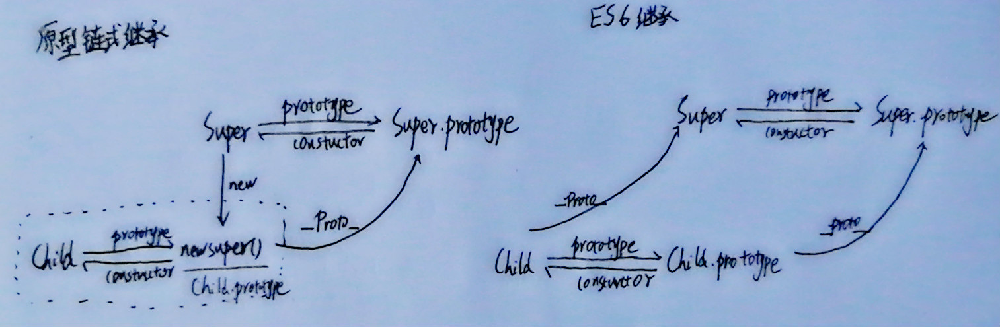

# ['1', '2', '3'].map(parseInt)
```js
arr.map(function callback(currentValue[, index[, array]]){   
    // Return element for new_array   
 }[, thisArg])
 ``` 
* callback一共可以接收三个参数，其中第一个参数代表当前被处理的元素，而第二个参数代表该元素的索引。
* parseInt(string, radix) 接收两个参数，第一个表示被处理的值（字符串），第二个表示为解析时的基数。  
返回[1, NaN, NaN]

# 防抖 节流
防抖和节流的作用都是防止函数多次调用。区别在于，假设一个用户一直触发这个函数，且每次触发函数的间隔小于wait，防抖的情况下只会调用一次，而节流的情况会每隔一定时间（参数wait）调用函数。
## 防抖
防抖的原理就是：你尽管触发事件，但是我一定在事件触发 n 秒后才执行，如果你在一个事件触发的 n 秒内又触发了这个事件，那我就以新的事件的时间为准，n 秒后才执行，总之，就是要等你触发完事件 n 秒内不再触发事件，我才执行。
```js
// 第一版
function debounce(func, wait, immediate) {

    var timeout;

    return function () {
        var context = this;
        var args = arguments;

        if (timeout) clearTimeout(timeout);
        // 立即执行的情况
        // if (immediate) {
        //     // 如果已经执行过，不再执行
        //     var callNow = !timeout;
        //     timeout = setTimeout(function(){
        //         timeout = null;
        //     }, wait)
        //     if (callNow) func.apply(context, args)
        // }
        // else {
            timeout = setTimeout(function(){
                func.apply(context, args)
            }, wait);
        // }
    }
}
```
## 节流
如果你持续触发事件，每隔一段时间，只执行一次事件。
```js
function throttle(func, wait) {
    var timeout;

    return function() {
        context = this;
        args = arguments;
        if (!timeout) {
            timeout = setTimeout(function(){
                timeout = null;
                func.apply(context, args)
            }, wait)
        }

    }
}
```

# Set、Map、WeakSet 和 WeakMap 的区别
## 集合Set
* Set 对象允许你储存任何类型的唯一值，无论是原始值或者是对象引用。
* Set 是以 [value, value]的形式储存元素，
* 向 Set 加入值的时候，不会发生类型转换(类似于a 不等于 "a", NaN等于 NaN)
* 遍历方法：keys(）等价于values()、entries()、forEach()

## 字典Map
* Map 是以 [key, value] 的形式储存
* new Map([[key1,value1],[key2,value2],[key3,value3]])
* Map 的键实际上是跟内存地址绑定的，只要内存地址不一样就视为两个键

### Tips：变量回收
Javascript是可以使用delete来手动删除变量，通过这样的方法让GC来回收内存，但在JS中并不是所有的对象都可以被删除的，delete 在JS中通过 var\function 声明因含有DontDelete，而不可被删除； 但是对象的属性、数组成员却是可以删除的； 因此如果我们要回收某个对象可以使用Object来封装一下。

### Tips：弱引用
WeakSet/WeakMap 中对对象的引用不会被考虑进垃圾回收机制，即只要没有其他的对象引用该对象，则该对象就会被回收，而不管它在不在 WeakSet。弱引用不需要手动null。

## WeakSet
WeakSet 和 Set 类似，都是不重复的值的集合，但是和 Set 有两点不同：

1. WeakSet 只能存放对象
2. WeakSet 的对象都是弱引用
  > WeakSet存放的对象不会计入到对象的引用技术, 因此不会影响GC的回收   
  > WeakSet存在的对象如果在外界消失了, 那么在WeakSet里面也会不存在
3. WeakSet 没有size属性，不支持遍历（故没有 forEach 方法)
  > 垃圾回收机制何时运行是不可预测的，所以 ES6 规定 WeakSet 不能被遍历

  JavaScript 会在执行内存回收时，清除掉 被引用次数为0 的那部分内存；而 WeakSet 是只能储存对象的（或者说只能储存内存指针而非静态值）、并且它对对象的引用将不计入对象的引用次数，当清除对象属性、对应的内存被清理之后，WeakSet 中记录的内存地址上不再有内容，它将自动断开与这条引用的关联 —— 也正因如此，它所储存的内容会受到开发者对其他对象操作的被动影响，所以 WeakSet 在设计上就设计成了没有“长度”、“遍历”概念的特殊弱引用 Set 型。

应用场景：用于存储DOM节点，而不用担心这些节点从文档移除时会引发内存泄露

## WeakMap
1. WeakMap只能接受对象作为键名字(null除外)
2. WeakMap键名指向对象不会计入对象的引用数
```js
let myElement = document.getElementById('logo');
let myWeakmap = new WeakMap();
myWeakmap.set(myElement, {timesClicked: 0});
myElement.addEventListener('click', function() {
  let logoData = myWeakmap.get(myElement);
  logoData.timesClicked++;
}, false);
```
上面代码中，myElement是一个 DOM 节点，每当发生click事件，就更新一下状态。我们将这个状态作为键值放在 WeakMap 里，对应的键名就是myElement。一旦这个 DOM 节点删除，该状态就会自动消失，不存在内存泄漏风险。
```js
const _counter = new WeakMap();
const _action = new WeakMap();
class Countdown {
  constructor(counter, action) {
    _counter.set(this, counter);
    _action.set(this, action);
  }
  dec() {
    let counter = _counter.get(this);
    if (counter < 1) return;
    counter--;
    _counter.set(this, counter);
    if (counter === 0) {
      _action.get(this)();
    }
  }
}
const c = new Countdown(2, () => console.log('DONE'));
c.dec()
c.dec()
```
Countdown类的两个内部属性_counter和_action，是实例的弱引用，所以如果删除实例，它们也就随之消失，不会造成内存泄漏。


# ES5/ES6 的继承区别
```js
class A extends B{}
A.__proto__ === B;  //继承属性
A.prototype.__proto__ == B.prototype;//继承方法
```


```js
class Colorpoint extends Point {
    constructor(x,y,color){
        super(x,y); //调用父类的constructor(x,y)
        this.color = color
    }
    toString(){
        //调用父类的方法
        return this.color + ' ' + super.toString(); 
    }
}
```
子类必须在constructor方法中调用super方法，否则新建实例时会报错。这是因为子类没有自己的this对象，而是继承父类的this对象，然后对其进行加工，如果不调用super方法，子类就得不到this对象。因此，只有调用super之后，才可以使用this关键字。

Tips:
* class 的所有方法（包括静态方法和实例方法）都是不可枚举的。
* class 的所有方法（包括静态方法和实例方法）都没有原型对象 prototype，所以也没有[[construct]]，不能使用 new 来调用。
* class 必须使用 new 调用

# 3 个判断数组的方法
* Object.prototype.toString.call([]); // "[object Array]"
    * Object.prototype.toString.call('An') // "[object String]"
    * Object.prototype.toString.call(1) // "[object Number]"
    * Object.prototype.toString.call(Symbol(1)) // "[object Symbol]"
    * Object.prototype.toString.call(null) // "[object Null]"
    * Object.prototype.toString.call(undefined) // "[object Undefined]"
    * Object.prototype.toString.call(function(){}) // "[object Function]"
    * Object.prototype.toString.call({name: 'An'}) // "[object Object]"
* []  instanceof Array; // true  
    * instanceof是判断类型的prototype是否出现在对象的原型链中，但是对象的原型可以随意修改，所以这种判断并不准确。
      ```js
      const obj = {}
      obj.__proto__ = Array.prototype
      // Object.setPrototypeOf(obj, Array.prototype)
      obj instanceof Array // true
      ```

* Array.isArray([]) // true

# let 和 const 声明的全局变量
并没有在全局对象中，只是一个块级作用域（Script）中
```js
let a = 1;
console.log(a)//1       有暂时性死区，a不能在let声明前调用
console.log(window.a) //undefined
console.log(this.a) //undefined
```

# IIFE(立即执行函数表达式)和函数表达式与函数声明与匿名函数
```js
var b = 10;
(function b() {
  // 'use strict' // TypeError: Assignment to constant variable.
  b = 20;
  console.log(b); //[Function: b]
})();
```

* 函数表达式与函数声明不同，函数名只在该函数内部有效，并且此绑定是常量绑定。
  ```js
  var a = function b(){ 
      console.log(b)
  }

  a() // [Function: b]
  console.log(b) // ReferenceError: b is not defined
  ```
* 对于一个常量进行赋值，在 strict 模式下会报错，非 strict 模式下静默失败。
* IIFE中的函数是函数表达式，而不是函数声明。
* **在非匿名自执行函数中，函数变量为只读状态无法修改**；

# Array.prototype.sort()
```js
[3, 15, 8, 29, 102, 22].sort();
// [102, 15, 22, 29, 3, 8]

 [3, 15, 8, 29, 102, 22].sort((a,b) => {return a - b});
 // [3, 8, 15, 22, 29, 102]
```

# 类数组
**当对象的length属性为非负整数，同时splice属性为函数时， 对象就变成伪数组**
```js
var obj = {
    '2': 3,
    '3': 4,
    'length': 2,
    'splice': Array.prototype.splice,
    'push': Array.prototype.push
}
obj.push(1)
obj.push(2)
console.log(obj) // Object(4) [empty × 2, 1, 2, splice: ƒ, push: ƒ]
```

* 类数组（ArrayLike）：
一组数据，由数组来存，但是如果要对这组数据进行扩展，会影响到数组原型，ArrayLike的出现则提供了一个中间数据桥梁，ArrayLike有数组的特性， 但是对ArrayLike的扩展并不会影响到原生的数组。

* push方法：
push 方法有意具有通用性。该方法和 call() 或 apply() 一起使用时，可应用在类似数组的对象上。push 方法根据 length 属性来决定从哪里开始插入给定的值。如果 length 不能被转成一个数值，则插入的元素索引为 0，包括 length 不存在时。当 length 不存在时，将会创建它。 唯一的原生类数组（array-like）对象是 Strings，尽管如此，它们并不适用该方法，因为字符串是不可改变的。

# call和apply
* Function.prototype.apply和Function.prototype.call 的作用是一样的，区别在于传入参数的不同；
* 第一个参数都是，指定函数体内this的指向；
* 第二个参数开始不同，apply是传入带下标的集合，数组或者类数组，apply把它传给函数作为参数，call从第二个开始传入的参数是不固定的，都会传给函数作为参数。
* [call比apply的性能要好](https://blog.csdn.net/QDY5945/article/details/101671581)，平常可以多用call。例如obj.call(obj, ...params)

# 箭头函数与普通函数的区别
## 箭头函数
* 没有 this，它会从自己的作用域链的上一层继承 this（因此无法使用 apply / call / bind 进行绑定 this 值）；
* 没有 arguments，当在箭头函数中调用 aruguments 时同样会向作用域链中查询结果；
* 没有 prototype 属性 ，而 new 命令在执行时需要将构造函数的 prototype 赋值给新的对象的 proto，同时执行一次构造函数绑定this，所以箭头函数无法new

### new
let obj = new Object()
let Con = [].shift.call(arguments)
obj.__proto__ = Con.prototype
Con.call(obj,arguments) 

## 普通函数
* 普通函数 this是看情况指向的，一般优先级是 new > bind > obj. > window 

# a.b.c.d 和 a['b']['c']['d']，性能比较
a.b.c.d 比 a['b']['c']['d'] 性能高点，后者还要考虑 [ ] 中是变量的情况，再者，从两种形式的结构来看，显然编译器解析前者要比后者容易些，自然也就快一点。
```js
const recast = require('recast')

const code1 = `a.b.c.d`
const code2 = `a['b']['c']['d']`

//解析
const ast1 = recast.parse(code1);
const ast2 = recast.parse(code2);
```

# ES6 转ES5
* AST 抽象语法树：将代码逐字母解析成 树状对象 的形式
Babel + polyfill
Babel编译原理：
* 解析：babylon 将 ES6/ES7 代码解析成 AST
* 转换：babel-traverse 对 AST 进行遍历转译，得到新的 AST
* 生成：新 AST 通过 babel-generator 转换成 ES5 
.vue文件通过webpack的vue-loader分析出script style template 再走上面的ES6转ES5流程

# 普通 for 循环的性能远远高于 forEach 的性能

# 数组里面有10万个数据，取第一个元素和第10万个元素的时间相差多少
数组元素的存储方式并不是连续的，而是哈希映射关系。哈希映射关系，可以通过键名 key，直接计算出值存储的位置

得出结论：消耗时间几乎一致，差异可以忽略不计

# 对象的键名的转换
```js
// example 1
var a={}, b='123', c=123;  
a[b]='b';
a[c]='c';  
console.log(a[b]);  // 'c'

---------------------
// example 2
var a={}, b=Symbol('123'), c=Symbol('123');  
a[b]='b';
a[c]='c';  
console.log(a[b]);  // 'b'

---------------------
// example 3
var a={}, b={key:'123'}, c={key:'456'};  
a[b]='b';   // 对象类型会调用 toString 方法转换成字符串 [object Object]。
a[c]='c';   // 这里会把 b 覆盖掉。
console.log(a[b]); // 'c'
```
对象的键名只能是字符串和 Symbol 类型。
其他类型的键名会被转换成字符串类型。
对象转字符串默认会调用 Object原型上的toString 方法。

# var、let 和 const 区别的实现原理
变量生命周期：**声明**（作用域注册一个变量）、**初始化**（分配栈内存，初始化为undefined）、**赋值**

* var：遇到有var的作用域，在任何语句执行前都已经完成了**声明**和**初始化**，也就是变量提升而且拿到undefined的原因由来
* function： **声明、初始化、赋值**一开始就全部完成，所以函数的变量提升优先级更高
* const、class、let：解析器进入一个块级作用域，发现let关键字，变量只是先完成**声明**，并没有到初始化那一步。此时如果在此作用域提前访问，则报错xx is not defined，这就是暂时性死区的由来。等到解析到有let那一行的时候，才会进入初始化阶段。如果let的那一行是赋值操作，则初始化和赋值同时进行
```js
console.log(a);    // ReferenceError: Cannot access 'a' before initialization
let a;
console.log(a);    // undefined;
a = 1;
console.log(a);       //1
```

## 变量提升
* let只是创建过程提升，初始化过程并没有提升，所以会产生暂时性死区。 
* var的创建和初始化过程都提升了，所以在赋值前访问会得到undefined 
* function 的创建、初始化、赋值都被提升了

## 函数提升
函数声明 声明和定义都会提前
函数表达式 var a =function(){}声明和定义不会提前

带函数名的函数表达式，var a =function b(){}它的函数名b只在函数内部有效，并且此绑定属于常量绑定。
带函数名的IIFE，var a =(function b(){})() 函数名b为 只读 状态，无法修改,变量名a在函数内部无法访问（块作用域）
[js样例](./IIFE和函数表达式.js)

## let 
* let 声明的变量的作用域是块级的；
* let 不能重复声明已存在的变量；
* let 有暂时死区，不会被提升。

# js值传递
```js
function changeObjProperty(o) {
  o.siteUrl = "http://www.baidu.com"
  o = new Object()
  o.siteUrl = "http://www.google.com"
} 
let webSite = new Object();
changeObjProperty(webSite);
console.log(webSite.siteUrl); // http://www.baidu.com
```
# 函数的方法挂载
```js
function Foo() {
    Foo.a = function() {
        console.log(1)
    }
    this.a = function() {
        console.log(2)
    }
}
// 以上只是 Foo 的构建方法，没有产生实例，此刻也没有执行

Foo.prototype.a = function() {
    console.log(3)
}
// 现在在 Foo 上挂载了原型方法 a ，方法输出值为 3

Foo.a = function() {
    console.log(4)
}
// 现在在 Foo 上挂载了直接方法 a ，输出值为 4

Foo.a();
// 立刻执行了 Foo 上的 a 方法，也就是刚刚定义的，所以
// # 输出 4

let obj = new Foo();
/* 这里调用了 Foo 的构建方法。Foo 的构建方法主要做了两件事：
1. 将全局的 Foo 上的直接方法 a 替换为一个输出 1 的方法。
2. 在新对象上挂载直接方法 a ，输出值为 2。
*/

obj.a();
// 因为有直接方法 a ，不需要去访问原型链，所以使用的是构建方法里所定义的 this.a，
// # 输出 2

Foo.a();
// 构建方法里已经替换了全局 Foo 上的 a 方法，所以
// # 输出 1
```

# 字符串String('11') === '11'
```js
String('11') == new String('11'); // 实际运行的是 String('11') == new String('11').toString();
String('11') === new String('11');
```

# var无视块级作用域
```js
var name = 'Tom';
(function() {
    console.info('name', name); // name undefined
    console.info('typeof name', typeof name); //typeof name undefined
    if (typeof name == 'undefined') {
        var name = 'Jack';
        console.log('Goodbye ' + name); // Goodbye Jack
    } else {
        console.log('Hello ' + name);
    }
})();
```
```typeof undefined == "undefined"```
```typeof null === "object"```

# 全局变量
```js
var name = 'Tom';
(function() {
  console.info('name', name); // name tom
  console.info('typeof name', typeof name); // typeof name string
if (typeof name == 'undefined') {
  name = 'Jack';
  console.log('Goodbye ' + name);
} else {
  console.log('Hello ' + name);   // Hello Tom
}
})();
```
1、首先在进入函数作用域当中，获取name属性   
2、在当前作用域没有找到name   
3、通过作用域链找到最外层，得到name属性   
4、执行else的内容，得到Hello Tom

### 类型转换 
大家都知道 JS 中在使用运算符号或者对比符时，会自带隐式转换，规则如下:
* -、*、/、% ：一律转换成数值后计算
* +：
    * 数字 + 字符串 = 字符串， 运算顺序是从左到右
    * 数字 + 对象， 优先调用对象的valueOf -> toString
    * 数字 + boolean/null -> 数字
    * 数字 + undefined -> NaN
* [1].toString() === '1'
* {}.toString() === '[object object]'
* NaN !== NaN 、+undefined 为 NaN
### 类型检查 
* typeof （number boolean object function string undefined）
    * NaN 的数据类型是 number
    * 数组(Array)的数据类型是 object
    * 日期(Date)的数据类型为 object
    *  **null 的数据类型是 object**  String(null) 来判断
    * 未定义变量的数据类型为 undefined
* instanceof （Array Date RegExp Object）
* constructor 返回构造函数
* Object.prototype.toString() 返回[Object XXX] 来判断
# 加性操作符，乘性操作符
1 + "1"
加性操作符：如果只有一个操作数是字符串，则将另一个操作数转换为字符串，然后再将两个字符串拼接起来

所以值为：“11”

2 * "2"
乘性操作符：如果有一个操作数不是数值，则在后台调用 Number()将其转换为数值

[1, 2] + [2, 1]
Javascript中所有对象基本都是先调用valueOf方法，如果不是数值，再调用toString方法。

所以两个数组对象的toString方法相加，值为："1,22,1"

"a" + + "b"
后边的“+”将作为一元操作符，如果操作数是字符串，将调用Number方法将该操作数转为数值，如果操作数无法转为数值，则为NaN。

# 循环嵌套
```js
var t1 = new Date().getTime()
for (let i = 0; i < 100; i++) {
  for (let j = 0; j < 1000; j++) {
    for (let k = 0; k < 10000; k++) {
    }
  }
}
var t2 = new Date().getTime()
console.log('first time', t2 - t1)

for (let i = 0; i < 10000; i++) {
  for (let j = 0; j < 1000; j++) {
    for (let k = 0; k < 100; k++) {

    }
  }
}
var t3 = new Date().getTime()
console.log('two time', t3 - t2)
```

两个循环的次数的是一样的，但是 j 与 k 的初始化次数是不一样的

第一个循环的 j 的初始化次数是 100 次，k 的初始化次数是 10w 次   
第二个循环的 j 的初始化次数是 1w 次， k 的初始化次数是 1000w 次

