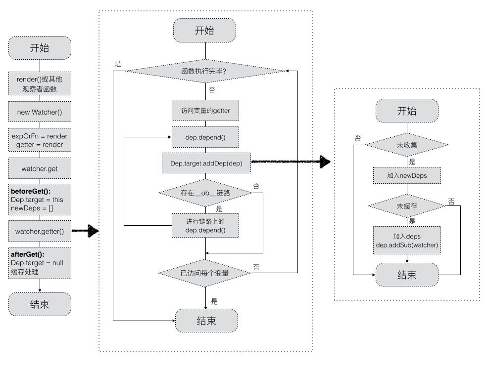
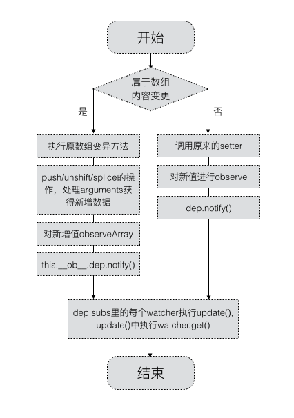

Vue源码中实现依赖收集，实现了三个类：

* Dep：扮演观察目标的角色，每一个数据都会有Dep类实例，它内部有个subs队列，subs就是subscribers的意思，保存着依赖本数据的观察者，当本数据变更时，调用dep.notify()通知观察者
* Watcher：扮演观察者的角色，进行观察者函数的包装处理。如render()函数，会被进行包装成一个Watcher实例
* Observer：辅助的可观测类，数组/对象通过它的转化，可成为可观测数据   
参考：[Vue依赖收集原理](https://ruphi.cn/archives/336/)  


## 创建响应式对象
init => initState => initData => observe => new Observer()

> initState 包含了对 data props methods computed watch
```js
data(){
    return {
        msg:'',
        show:true
    }
}
```
其中 value 为 
```js
{
    msg:'',
    show:true
}
```

* 在 value 对象 上定义 `__ob__` 属性，来保存当前数据的 Observer实例
    * 创建 Dep 对象，其中 subs 数组 来保存该数据的所有watcher
* walk 遍历 value
    * value 中的每一个属性，都执行 defineReactive => oberve() 重复上述步骤，直到value不再是一个对象或Vnode
    * 为每一个属性 defineProperty() 定义 setter getter方法

> 用户自定义watcher在init阶段就生成了，而渲染watcher是在 mount过程中生成，所以用户自定义的 watcher id 小于 渲染 watcher

```js
function observe(value){
    if(/* 不是对象 或 是 vnode*/){
        return;
    }
    new Observe(value);
}

function Observe(value){
    this.dep = new Dep(); // Observe.dep
    value.__ob__ = this;
    if(/*数组*/){
        //处理数组
        //数组添加增强后的 会改变原数组的操作（pop，push，shift，unshift，reverse，sort，splice）
        this.observeArray(value);//数组没有defineReactive的操作 
    }else{
        this.walk(value)
    }
}

Observe.prototype.walk = function(value){
    // 遍历 value 的每一个属性
    defineReactive(value,key);
}

function defineReactive(obj,key){
    var dep = new Dep() //闭包dep
    childob = observe(obj[key]);
    //定义 getter settter
    Object.defineProperty(obj,key,{
        get(){

        },
        set(){

        }
    })
}

observeArray (items: Array<any>) {
    for (let i = 0, l = items.length; i < l; i++) {
      observe(items[i])
    }
  }

```

```js
get: function reactiveGetter () {
      const value = getter ? getter.call(obj) : val
      if (Dep.target) {  //判断是否在渲染阶段
        dep.depend() // 对象内容（数据）闭包dep 的依赖收集
        if (childOb) {
          childOb.dep.depend()  //  如果属性的值是个对象就要对其 对象 __ob__.dep 进行依赖收集 针对 数组和对象增加 删除属性
          if (Array.isArray(value)) {
            dependArray(value)
          }
        }
      }
      return value
    },
    set: function reactiveSetter (newVal) {

      const value = getter ? getter.call(obj) : val
      /* eslint-disable no-self-compare */
      if (newVal === value || (newVal !== newVal && value !== value)) {
        return
      }
      /* eslint-enable no-self-compare */
      if (process.env.NODE_ENV !== 'production' && customSetter) {
        customSetter()
      }
      // #7981: for accessor properties without setter
      if (getter && !setter) return
      if (setter) {
        setter.call(obj, newVal)
      } else {
        val = newVal
      }
      childOb = !shallow && observe(newVal) // 如果是对象，则响应式
      dep.notify() //
    }
```

## 依赖收集

* 在创建响应式对象Observer实例，其中创建的Dep对象用来保存 data 和 watcher 之间的依赖关系
* 在渲染的过程中，实例化watcher对象的构造函数中会执行 `watcher.get()`，生成的渲染watcher对象会在 将全局遍历Dep.targer设为自身，（在targetStack栈中保存递归调用生成的watcher），接着执行 `watcher.getter`,也就是（`vm._update(vm._render())`）,
* render的过程 中触发数据 data 的 getter方法，（也就是在initData中通过 defineProperty 绑定的get方法）,执行 `dep.depend()` 会将当前数据的 Dep 实例中的 subs 数组中添加 watcher （订阅者）。watcher实例中 deps数组会添加 dep 对象（用于比较 新旧 dep）
    * cleanupDeps，根据 watcher 中保存的 新旧 deps，如果新添加的dep在旧deps中不存在，就要删除 当前旧dep.subs 中的 当前watcher，这样就不会触发不必要的更新

```js
//Dep 对象
depend () {
    if (Dep.target) {
      Dep.target.addDep(this)
    }
  }

// Watcher 对象
  get () { //依赖收集
    pushTarget(this)  //修改 Dep.Target
    let value
    const vm = this.vm
    try {
       
      value = this.getter.call(vm, vm)  //渲染dom   watcher key值
    } catch (e) {
      if (this.user) {
        handleError(e, vm, `getter for watcher "${this.expression}"`)
      } else {
        throw e
      }
    } finally {
      // "touch" every property so they are all tracked as
      // dependencies for deep watching
      if (this.deep) {  // 深度遍历对象
        traverse(value)
      }
      popTarget()
      this.cleanupDeps()
    }
    return value
  }

 addDep (dep: Dep) {
    const id = dep.id
    if (!this.newDepIds.has(id)) {
      this.newDepIds.add(id)
      this.newDeps.push(dep)
      if (!this.depIds.has(id)) {
        dep.addSub(this)
      }
    }
  }
cleanupDeps () {  // 删除新页面中不会再用到的 watcher
    let i = this.deps.length
    while (i--) {
      const dep = this.deps[i]
      if (!this.newDepIds.has(dep.id)) {
        dep.removeSub(this)
      }
    }
    let tmp = this.depIds
    this.depIds = this.newDepIds
    this.newDepIds = tmp
    this.newDepIds.clear()
    tmp = this.deps
    this.deps = this.newDeps
    this.newDeps = tmp
    this.newDeps.length = 0
  }
```

```js
{
    __ob__, // Observer类的实例，里面保存着Dep实例__ob__.dep => dep(uid:0)
    a: 1,   // 在闭包里存在dep(uid:1)
    b: [2, 3, 4], // 在闭包里存在着dep(uid:2)，还有b.__ob__.dep => dep(uid:4)
    c: {
        __ob__, // Observer类的实例，里面保存着Dep实例__ob__.dep => dep(uid:5)
        d: 5 // 在闭包里存在着dep(uid:6)
    }
}
```
1. 在对 c 执行 defineReactive时，会生成一个 c 的 闭包dep
2. 然后对其值 `{d:5}`执行observe方法，生成一个Observe实例挂载在 `c.__ob__`
3. 在进行依赖收集，执行 c 的get方法时，不仅为闭包dep进行依赖收集，也为c的observe实例的dep进行依赖收集
4. 闭包dep，在c的值发生改变时触发set方法时，会执行 闭包dep的notify
5. 如果通过 Vue.set 为c的值这个对象添加一个属性，不会触发c的set方法，但是会通过 `c.__ob__.dep` 来触发notify。如果在c进行依赖收集时，没有为`c.__ob__`进行依赖收集，那么就不会触发相关watcher的更新


> 为什么对于对象，配置依赖观测后，会实例化两个Dep类实例呢？
这是因为：对象，都是引用类型数据，对于引用类型数据，存在两种操作：改变引用和改变内容.

> 对象，改变引用 修改某一个属性，通过 闭包dep 来派发更新 ;对其增加 删除某一属性,通过 `__ob__` 来派发更新

> 数组，都需要通过 `__ob__` 来检测，在对数组进行响应式处理时，会修改数组原型上会改变数组自身的操作，（push，pop，splice），它们会获取到插入的值，然后把新添加的值变成一个响应式对象，在执行原先操作之后，手段派发notify通知。

一共有四个地方调用了dep.notify。

其中三个地方是调用了ob.dep.notify()。
分别是：
1. 对数组push等七个方法重写的函数中
2. set方法，为一个对象添加一个属性
3. del方法，为对象删除一个属性

而闭包中的dep.notify()只是在Object.defineProperty的set方法中触发。

那么很清楚了，#1是闭包中的Dep，用于由对象本身修改而触发setter函数导致闭包中的Dep通知所有的Watcher对象。#2则是在对象本身增删属性或者数组变化的时候被触发的Dep。

## 派发更新
* 当对数据进行更改时，会触发 setter方法，setter方法 会比较新旧值是否相同，不同则触发 dep.notify()。 （其中 watcher 也是按照从小到大排序）
* dep中的 subs数组保存着与该数据相关联的 渲染 watcher，调用watcher的update方法
* 执行 queueWatcher，将需要更新的渲染watcher保存到任务队列中（防止watcher的重复渲染），等待 nextTick时统一进行更新 flushSchedulerQueue
    * 在更新的过程中会对 watcher 的 id 从小到大排序，
        1. 因为组件是从父到子生成的
        2. 用户 watcher 总是 在 渲染 watcher 之前渲染
        3. 如果 父组件销毁，那么就不需要重新渲染子组件
    * 执行 watcher.run()

```js
//watcher
update () {
    /* istanbul ignore else */
    if (this.lazy) {
      this.dirty = true
    } else if (this.sync) {   //同步
      this.run() 
    } else {
      queueWatcher(this)
    }
  }

//schedule
function queueWatcher(){
  const id = watcher.id
  if (has[id] == null) {
    has[id] = true  //防止 watcher 的多次调用
    if (!flushing) {  
      queue.push(watcher)
    } else {//正在执行中
      // if already flushing, splice the watcher based on its id
      // ** if already past its id, it will be run next immediately.
      //由于watcher.run 运行的过程中，用户定义的回调函数出发了新的watcher
      let i = queue.length - 1
      while (i > index && queue[i].id > watcher.id) {
        i--
      }
      queue.splice(i + 1, 0, watcher)
    }
    // queue the flush
    if (!waiting) {
      waiting = true

      if (process.env.NODE_ENV !== 'production' && !config.async) {
        flushSchedulerQueue()
        return
      }
      nextTick(flushSchedulerQueue)  //异步
    }
  }
}

//watcher
run () {
    if (this.active) {
      const value = this.get()  //得到值 触发 _update(_render())
      if (
        value !== this.value ||
        // Deep watchers and watchers on Object/Arrays should fire even
        // when the value is the same, because the value may
        // have mutated.
        isObject(value) ||
        this.deep
      ) {
        // set new value
        const oldValue = this.value
        this.value = value
        if (this.user) {
          try { // watch
            this.cb.call(this.vm, value, oldValue) //watch update
          } catch (e) {
            handleError(e, this.vm, `callback for watcher "${this.expression}"`)
          }
        } else { 
          this.cb.call(this.vm, value, oldValue)
        }
      }
    }
  }
```
## nextTick()
### Vue 2.6

推荐使用微任务（Promise MutationObserver ）来执行 回调函数，如果浏览器不支持，最终会使用 (setImmediate setTimeout)的形式

1. 每次调用 nextTick 都会判断当前是否有 tick 在执行，当 tick 真正执行的时候会置 pending为 false，此时调用 nextTick 可以开启下一个异步任务到浏览器的任务队列。
2. 如果 pending  为 false， 就只能往 callbacks 里添加回调函数
3. 当 下一个 tick 开始执行时，会将 callbacks 拷贝一份执行里面的回调函数 并清空，又会将 pending 置为 false

* 每次调用 nextTick ， 回调函数都会被存储在 callbacks数组中，只有当上一个callbacks数组执行的异步任务在事件循环中被执行（也就是执行flushCallbacks函数，将pending = false），才能执行新的callbacks数组，将异步任务添加到事件循环中的任务队列中。在此之前所有的 回调函数都会被添加到上一个callbacks数组，等待本次 tick 执行。

> $nextTick 回调函数在下一个事件循环中执行

```js
function flushCallbacks () {
  pending = false
  const copies = callbacks.slice(0)
  callbacks.length = 0
  for (let i = 0; i < copies.length; i++) {
    copies[i]()
  }
}

timerFunc = () => {
    p.then(flushCallbacks)
    // In problematic UIWebViews, Promise.then doesn't completely break, but
    // it can get stuck in a weird state where callbacks are pushed into the
    // microtask queue but the queue isn't being flushed, until the browser
    // needs to do some other work, e.g. handle a timer. Therefore we can
    // "force" the microtask queue to be flushed by adding an empty timer.
    if (isIOS) setTimeout(noop)
  }
  
export function nextTick (cb?: Function, ctx?: Object) {
  let _resolve
  callbacks.push(() => {
    if (cb) {
      try {
        cb.call(ctx)
      } catch (e) {
        handleError(e, ctx, 'nextTick')
      }
    } else if (_resolve) {
      _resolve(ctx)
    }
  })
  if (!pending) {
    pending = true  // 
    timerFunc()
  }
  // $flow-disable-line
  if (!cb && typeof Promise !== 'undefined') {
    return new Promise(resolve => {
      _resolve = resolve
    })
  }
}

```
### Vue 2.5
默认使用 微任务形式，如果浏览器不支持吗，那么使用 宏任务形式
也会对外提供  withMacroTask ，来使用宏任务形式（用于处理一些 DOM 交互事件，如 v-on 绑定的事件回调函数的处理，会强制走 macro task）

当某个操作触发了 nextTick 时，如果此时上一个Tick已经在执行，或者已经执行完毕，那么就可以开启本次异步Tick。在本次异步tick还没有执行前，同步操作触发的 nextTick 方法都会保存到同一个 callbacks 中，等待本次异步tick执行。

## 监听对象和数组变化的特殊情况
### 添加 删除 对象属性
Vue.set 
* 数组 -> splice -> 触发修改后的数组原生方法 -> notify
* 对象
    * 有该键值 直接修改
    * 没有 添加该属性
        * 获取该对象的 observer 对象
            * 不是响应式对象 直接返回
        * 将该属性变为响应式数据 defineReactive(ob.value, key, val) ,（在使用的时候会调用 getter 来进行赋值）
        * ob.dep.notify 手动触发更新
```js
if (Array.isArray(target) && isValidArrayIndex(key)) {
    target.length = Math.max(target.length, key);
    target.splice(key, 1, val);
    return val
  }

  var ob = (target).__ob__;
  if (!ob) {
    target[key] = val;
    return val
  }
  defineReactive(ob.value, key, val);
  ob.dep.notify();
```
Vue.delete
* 数组 -> splice -> 触发修改后的数组原生方法 -> notify
* 对象
    * 没有该键值 直接返回
    * 有 删除该属性
        * 获取该对象的 observer 对象
            * 不是响应式对象 直接返回
        * `delete target[key] `
        * ob.dep.notify 手动触发更新
```js
if (Array.isArray(target) && isValidArrayIndex(key)) {
    target.splice(key, 1);
    return
  }
  var ob = (target).__ob__;
if (!hasOwn(target, key)) {
    return
  }
  delete target[key];
  if (!ob) {
    return
  }
  ob.dep.notify();
```

### 修改数组内的 数据
数组是不能直接通过赋值来修改数组内的数据，因为 他没有为每一个值执行 defineReactive 设置 getter setter 方法
* Vue.set  当你利用索引直接设置一个项时Vue.set(arr,index,value) 或 splice(start,1,value)
* 数组原生方法
数组，都需要通过 `__ob__` 来检测，在对数组进行响应式处理时，会修改数组原型上会改变数组自身的操作，（push，pop，splice...），它们会获取到插入的值，然后把新添加的值变成一个响应式对象，在执行原先操作之后，手段派发notify通知。


在为数组生成 Observe对象实例 时，会将 arrayMethods 作为数组的原型添加上去
```js
export const arrayMethods = Object.create(arrayProto)
const methodsToPatch = [
  'push',
  'pop',
  'shift',
  'unshift',
  'splice',
  'sort',
  'reverse'
]

methodsToPatch.forEach(function (method) {
  // cache original method
  const original = arrayProto[method]
  def(arrayMethods, method, function mutator (...args) {
    const result = original.apply(this, args)
    const ob = this.__ob__
    let inserted
    switch (method) {
      case 'push':
      case 'unshift':
        inserted = args
        break
      case 'splice':
        inserted = args.slice(2)
        break
    }
    if (inserted) ob.observeArray(inserted) //对于插入操作 push unshift splice,对插入的数据进行响应式处理

    // notify change
    ob.dep.notify()
    return result
  })
})

```


### proxy 代理 与 defineProperty 
1. proxy是直接代理一个对象，defineProperty需要为对象的每一个属性设置get、set方法
2. proxy 可以直接 `target[key]` 返回原对象的值，而 defineProperty 需要从其他保存值的地方取值
3. proxy 可以直接识别 为一个对象添加属性的操作 ，而 defineProperty 需要通过 Vue.set方法添加响应式属性
```js
const proxy = new Proxy(obj, {
    set(target, property, value, receiver) {
      // 如果receiver === target，表明proxy处于被赋值对象的原型链上
      // https://developer.mozilla.org/en-US/docs/Web/JavaScript/Reference/Global_Objects/Proxy/handler/set
      // 仅仅拦截直接对proxy的赋值操作（reactiveProxy.newProperty=newValue）
      if (!target.hasOwnProperty(property) && receiver === proxy) {
        if (typeof value === "object" && value !== null) {
          // 如果要赋的值也是对象，则也要拦截这个对象的赋值操作
          value = createReactiveProxy(value);
        }
        // console.log("Vue.set ", target, property);
        Vue.set(target, property, value);
        return true;
      } else {
        // console.log("Reflect.set ", target, property);
        return Reflect.set(...arguments);
      }
    }
  });
```


### 为什么组件的data一定要是函数返回对象的形式
因为组件是可以复用的，其中的data就是用户在定义组件时生成的data对象，如果传入的是一个对象，那么每一个组件实例都公用同一个data对象，因为是引用。

而如果使用函数的形式，在每生成一个组件实例时，都调用一次data方法，返回一个新的data对象，这个data是每个组件实例独享的

```js
function component(data){
	this.data = (typeof data === 'function'?data():data)
}

var c1 = new component(data)
var c2 = new component(data)

c1.data === c2.data //false
```
